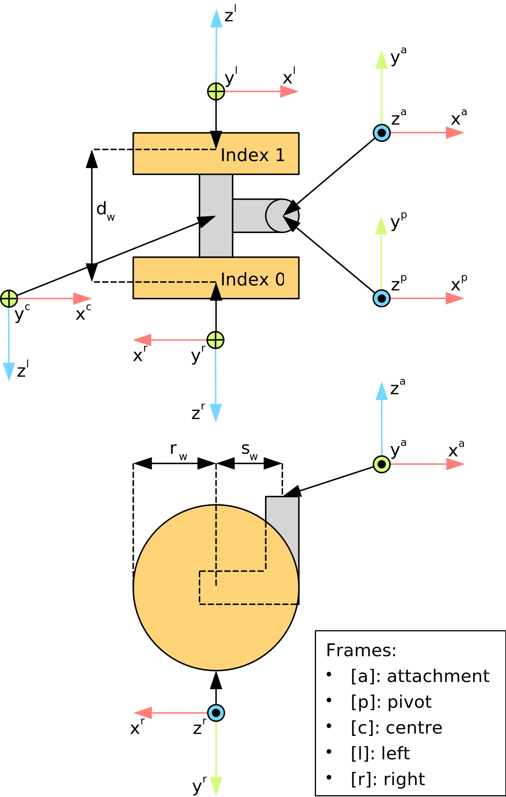

Frames for a KELO platform
**************************

Drive unit
==========

Kinematically, each drive unit is the composition of (i) a differential drive; and (ii) a castor wheel.
Each individual wheel features a hub-drive, i.e. the motor is placed inside a wheel to directly actuate its axle.
This design implies that a drive unit is singularity-free, i.e. the two wheels can produce arbitrary (linear) forces at the pivot joint.
The wheels and the pivot joint rotate around the positive :math:`z` axis.

Frame diagram
-------------

Top-down view:

.. parsed-literal::
                    +x ^
                       |
                  +y   |
                  <----+ [p]
                       o                        ^
      +x ^    ^        |                 castor |
         |    |     _  |  _              offset |
    +z   |    |    | | | | |       [r]          |
    <----o   f[l]  | |-+-| |  f[r]  o---->      v
        [l]        |_|   |_|   |    |   +z
        [c]       left  right  |    |
                               v    v +x
                    |-----|
                 wheel distance

Coordinate frames' axes
-----------------------

===========  ======  =========  =========  =========
   Frame     Symbol  :math:`x`  :math:`y`  :math:`z`
===========  ======  =========  =========  =========
Left wheel     [l]     front      down       left   
Right wheel    [r]     rear       down       right  
  Centre       [c]     front      down       right  
   Pivot       [p]     front      left        up    
===========  ======  =========  =========  =========

Coordinate frames' origins
--------------------------

======  ===================  ===================  =====================
Symbol       :math:`x`            :math:`y`            :math:`z`       
======  ===================  ===================  =====================
  [l]         on axle           wheel centre          wheel centre     
  [r]         on axle           wheel centre          wheel centre     
  [c]         on axle           wheel centre      centre between wheels
  [p]   on pivot joint axis  on pivot joint axis           ---         
======  ===================  ===================  =====================

Platform
========

Drive units are ordered in mathematically positive direction (counter-clockwise in the top-down view), starting at the front-left wheel.
The positive direction of the pivot joints (in the top-down view) is clockwise, i.e. the pivot joints rotate around the positive :math:`z` axis.

Top-down view:

.. parsed-literal::
          +x ^
             |  W1 |-|      |-| W4
             |      |        |
        <----+      o--------o         ^ +x
        +y  [a]     |        |         |
                    |        |         |
                    |        |    <----+ [p]
                    |        |    +y
                    o--------o
                    |        |
                W2 |-|      |-| W3

Coordinate frames' axes
-----------------------

==========  ======  =========  =========  =========
  Frame     Symbol  :math:`x`  :math:`y`  :math:`z`
==========  ======  =========  =========  =========
 Platform     [p]     front      left        up    
Attachment    [a]     front      left        up    
==========  ======  =========  =========  =========

Coordinate frames' origins
--------------------------

======  ===================  ===================  =========
Symbol       :math:`x`            :math:`y`       :math:`z`
======  ===================  ===================  =========
  [p]     platform centre      platform centre       ---   
  [a]   on pivot joint axis  on pivot joint axis     ---   
======  ===================  ===================  =========